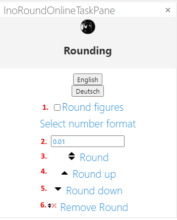

# Excel Add-In which adds a graphical user interface to use the rounding functions

Currently the user interface is available in English and German. While loading the Add-In the Office.context.displayLanguage is detected. If it is German then the add-in will be displayed in German other wise it while be English. 

## Installation

ToDo

## Usage

Select a range and go to the taskpane

If 1 "Round figures"  is ticked given figures are rounded as well.

The number of digits to round to are defined at 2.

3 to round flexible

4 to round up

5 to round down

6 remove existing round function